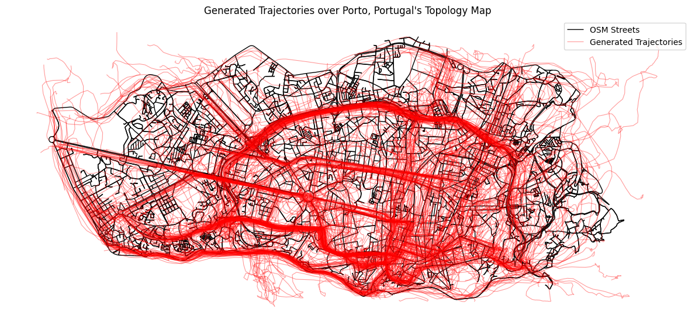

### Objective
reproduce the [Difftraj](https://github.com/Yasoz/DiffTraj) by Zhu et al.\(2023\).\
dataset: Porto taxi dataset from keggle ([porto_taxi_dataset](https://www.kaggle.com/datasets/crailtap/taxi-trajectory))

### contents
- preprocess raw trajectory data
- train with preprocessed data (not included, see origial difftraj repo)
- plot the generated trajectory
### parameters
'batch_size': 512, (compromised because of the lack of computation resources, 1024 in original works)  
'n_epochs': 200,  
'n_iters': 5000000,  
### results

